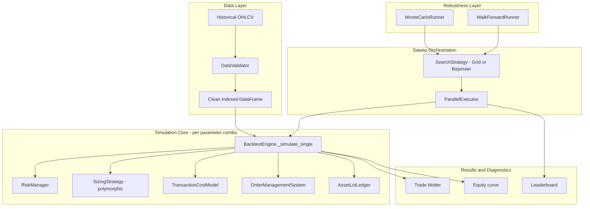
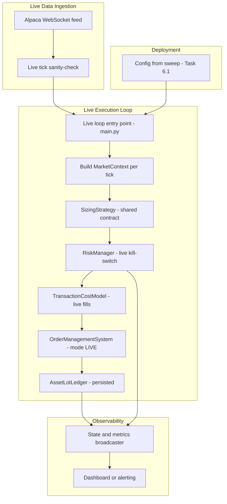

# TQQQ Grid Volatility-Harvesting System — Architecture Overview

*Companion file: `implementation_task_specs.md` — 45 implementation tasks plus 1 discovery gate. This file is the shared context every task assumes; the task file has the task-specific "how."*

## How to use these two documents

- **This file** is shared, reusable context: system purpose, design philosophy, the canonical interfaces multiple tasks depend on, module layout, and a full task index. It rarely changes.
- **`implementation_task_specs.md`** has one self-contained spec per task: goal, preconditions, exact files, step-by-step instructions, and acceptance criteria.
- **To hand a task to an agent:** give it this file plus only that task's subsection from the task-spec file. Nothing else from either document should be required to implement, test, and validate that task.
- Where a task implements a shared interface defined here (§5), its instructions say "implement exactly as specified in §5.X" rather than repeating the code — copy it from here, don't re-derive it.
- Tasks list their preconditions explicitly. A few have a *soft* dependency on a later-numbered task for cleanliness even though they're grouped earlier by topic — those are called out where they occur (see Task 2.3).

> **Revision note:** this revision synchronizes the architecture context with the v4 implementation-task specification. It promotes the no-loss sell rule, canonical accounting formulas, execution sequencing, state ownership, idempotency, order lifecycle, reconciliation, startup/shutdown, durable audit, deployment provenance, and secret separation into architecture-level context. The task file remains the implementation authority for task-specific behavior. Unconfirmed external claims remain explicitly flagged in §8 rather than treated as facts.
>
> The two-file design is intentional: this overview stays compact and stable enough to provide to an AI agent with any single task; the task file contains the detailed implementation instructions.

> **Revision v6.1:** this overview adds the final specification-freeze rules on top of the v6 canonical time/numeric precision, data/event, idempotency, persistence, reconciliation, and domain-object contracts., data/event schemas, idempotency identity, persistence technology, reconciliation precedence, and shared domain objects so agents do not have to choose between multiple compatible-looking implementations.

## 1. System purpose

A grid-based volatility-harvesting strategy for leveraged ETFs (primarily TQQQ): buy on configurable price-drop steps, harvest profits when a lot reaches its target sell price, with pluggable sizing strategies controlling how much capital each buy deploys. The system supports both parameter-sweep backtesting and live trading via Alpaca.

## 2. Design goals & compatibility philosophy

1. **Fix genuine bugs unconditionally.** Confirmed defects (see §3) aren't behavior choices — there's no "safe default" that means "keep the bug."
2. **Make every behavior/policy change opt-in, defaulting to current behavior.** Risk caps, transaction costs, fill realism, re-entry policy, search strategy, and parallelism all default to reproducing today's output exactly.
3. **Extract, don't rewrite.** The refactor is mostly pulling the existing single-run logic into its own method, not reinventing the simulation.
4. **Make the sweep trustworthy, not just fast.** Walk-forward and Monte Carlo layers exist specifically so a "winning" parameter combination means something.

## 2.1 Non-negotiable trading invariants

These rules are architectural invariants and apply to backtest, paper, and live execution. Individual tasks may implement or enforce them, but no task may weaken or bypass them.

1. **Rule One — never intentionally sell at a loss.** A sell is permitted only when net proceeds for the quantity being sold are at least the allocated cost basis for that quantity, after sell-side fees and modeled execution costs.
2. A risk halt means **stop opening additional exposure**. It does not authorize forced liquidation at a loss.
3. Accounting is fill-driven. Cash, positions, lots, and realized P&L change only from confirmed fill or broker-reconciliation events.
4. Partial fills mutate only the confirmed filled quantity. Unfilled quantity remains associated with the order until it is filled, canceled, expired, or reconciled.
5. Duplicate market, order, and fill events must be idempotent. Replaying an already-applied event must not double-count cash, shares, lots, or orders.
6. Backtest and live execution use the same strategy-facing `MarketContext`/`SizingStrategy` contracts and the same decision ordering unless a documented simulation-only difference exists.
7. A shutdown, reconnect, circuit breaker, retry handler, or reconciliation path must not bypass the no-loss exit guard.

### Canonical accounting formulas

```text
allocated_cost_basis = acquisition_notional + allocated_buy_costs + other attributable acquisition costs
net_sell_proceeds    = filled_quantity * effective_sell_price - sell_costs
realized_pnl         = net_sell_proceeds - allocated_cost_basis

sell_permitted iff net_sell_proceeds >= allocated_cost_basis
```

For a partial lot sale, allocate cost basis proportionally to the quantity sold unless a future accounting policy explicitly supersedes this rule.

## 2.2 Canonical data, time, and numeric policies

These policies are shared implementation contracts. A task may not introduce a local alternative without explicitly changing this section.

### Time

- All internal timestamps are timezone-aware `datetime` values in **UTC**.
- Historical `DataFrame` indexes must be a timezone-aware `pd.DatetimeIndex` normalized to UTC.
- Naive timestamps are rejected at validation boundaries; they are never implicitly interpreted as local time.
- Live broker/data-provider timestamps are converted to UTC immediately at ingestion.
- Market events with timestamps materially ahead of the system clock are rejected or held according to the live-data validation policy; they are never silently backdated.
- Duplicate timestamps are preserved only when they represent distinct event IDs. Duplicate market bars without distinct event identity are rejected.
- Daylight-saving/local-market-time conversion is presentation-only; strategy/accounting state is always UTC.

### Money and quantities

- Monetary values are represented internally as `float` unless the repository already uses `Decimal` consistently for the affected component; do not introduce mixed numeric representations within one accounting path.
- Money comparisons use `MONEY_EPSILON = 1e-8` unless a task explicitly requires broker currency rounding.
- Share/quantity comparisons use `SHARE_EPSILON = 1e-6`.
- Broker-reported fills are the source of truth for quantity and execution price. Requested quantity is never treated as filled quantity.
- When a broker exposes only cumulative order `filled_qty` and `filled_avg_price`, the incremental fill notional is `current_qty * current_avg_price - previous_qty * previous_avg_price`; incremental fill quantity is `current_qty - previous_qty`; incremental average price is incremental notional divided by incremental quantity. Never multiply a newly filled quantity by the cumulative average price.
- Currency presentation/serialization is rounded to cents only at an external boundary; internal calculations are not repeatedly rounded.
- Tests comparing floating-point accounting use `math.isclose()` with the canonical tolerances unless exact equality is specifically part of the contract.

### Canonical historical-data schema

Historical OHLCV input is a `pandas.DataFrame` with:

```text
index: timezone-aware UTC DatetimeIndex, sorted ascending, no duplicate timestamps
columns: open, high, low, close, volume
open/high/low/close/volume: numeric, finite
```

Additional columns are permitted and preserved unless a task explicitly rejects them. Required-column validation, NaN/Inf handling, and empty-frame behavior are defined by the data-validation task; consumers must not silently invent missing values.

## 2.3 State ownership

Each mutable state category has one authoritative owner. Components may read state owned by another component but must not silently create competing copies.

| State | Authoritative owner | Mutation source | Persistence expectation |
|---|---|---|---|
| Market snapshot | `MarketContext` / market-data layer | validated market events | transient |
| Strategy rolling state | `SizingStrategy` instance | `record_tick()` | isolated per simulation; persisted only if required by live recovery |
| Cash/equity | account/portfolio state | confirmed fills + reconciliation | durable in live mode |
| Open lots / cost basis | `AssetLotLedger` | confirmed fills + reconciliation | durable in live mode |
| Order lifecycle | OMS/order state | broker acknowledgements/status/fills | durable in live mode |
| Risk halt state | `RiskManager` / live risk state | risk conditions + manual reset | durable across restart |
| Deployment identity | immutable deployment artifact | promotion process | immutable |
| Audit history | durable event/audit store | domain events | durable |

No component should mutate another component's state merely to make totals match. Discrepancies are resolved through the reconciliation policy.

## 2.4 Canonical market-decision sequence

The following sequence is the default ordering for each market event/bar:

```text
receive/validate market event
→ update market/account state
→ update peak equity/drawdown
→ construct immutable MarketContext
→ strategy.record_tick(context)
→ evaluate sell/harvest opportunities
→ evaluate buy/grid trigger
→ calculate proposed buy value
→ apply risk controls
→ create OrderIntent
→ submit through OMS/broker adapter
→ process confirmed fill events
→ update ledger/accounting
→ persist durable state
→ emit audit/observability event
```

A task that implements one stage must not silently reorder another stage. Sell economics and the no-loss guard occur before an exit order crosses the broker boundary.

## 2.5 Canonical domain objects and event identity

The following immutable objects are shared vocabulary. Tasks may extend them only by updating this section and the affected task contracts.

Canonical location: `src/execution_models.py`. If an existing repository module already owns an equivalent immutable model, the implementation may retain that location only after verifying that its public shape is identical to this contract.

```python
@dataclass(frozen=True)
class OrderIntent:
    intent_id: str
    decision_id: str
    symbol: str
    side: str
    quantity: float
    limit_price: float | None

@dataclass(frozen=True)
class Fill:
    fill_id: str
    order_id: str
    quantity: float
    price: float
    fees: float
    timestamp: datetime

@dataclass(frozen=True)
class SellEconomics:
    quantity: float
    allocated_cost_basis: float
    sell_costs: float
    net_sell_proceeds: float
    realized_pnl: float
```

### Event identity

One stable identifier scheme is used by idempotency, order deduplication, and audit. A logical event/decision ID is the SHA-256 hex digest of a canonical UTF-8 serialization of:

```text
deployment_id | strategy_id | symbol | market_event_id | decision_type | sequence_number
```

Canonical serialization rules:
- UTF-8 encoding.
- Lexically ordered object keys when JSON objects are used.
- No insignificant whitespace.
- Explicit separators between fields.
- SHA-256 lowercase hexadecimal output.

The same logical decision must produce the same ID across reconnects and process restarts. A newly generated ID for a replayed decision is forbidden.

## 2.6 Durable persistence contract

Live durable state uses **SQLite** as the canonical persistence backend. JSONL, pickle, ad-hoc files, or a second database are not interchangeable implementations.

Canonical database responsibilities:

```text
ledger_lots       -> open/closed lot state and cost basis
order_state       -> OrderIntent/broker-order lifecycle
processed_events  -> idempotency/event application records
audit_events      -> durable audit/event stream
revisions         -> monotonically increasing state revisions
```

Required persistence properties:
- SQLite transactions are atomic for each logical state transition.
- WAL mode may be enabled, but correctness must not depend on a particular journaling mode.
- Every durable record includes a schema version.
- State mutations carry a monotonically increasing revision/sequence.
- Recovery is idempotent. Replaying the same event cannot create a second mutation.
- A crash cannot expose a partially committed logical state transition to recovery.
- Persistence is acknowledged only after the transaction is durably committed according to the selected SQLite durability settings.

## 2.7 Reconciliation precedence

Broker state is authoritative for **what the broker says actually exists**; the local ledger/order store is authoritative for **the system's historical decision and accounting intent**. A disagreement is not resolved by silently overwriting one side.

| Condition | Required action |
|---|---|
| Local and broker agree | Continue `READY` |
| Broker has an order/fill absent locally | Import/reconstruct broker event, then reconcile accounting |
| Local order exists but broker cannot find it | Query by stable client order ID; if still absent, mark `UNKNOWN` and halt affected trading |
| Position quantity differs | Enter reconciliation; never invent a fill or silently change cost basis |
| Cash differs | Enter reconciliation; do not trade from guessed cash |
| Fill quantity appears to go backwards | Enter reconciliation; never reverse prior accounting automatically |
| Ambiguous submission | Resolve through broker query/reconciliation before any resubmission |
| Unresolvable mismatch | `RECONCILIATION_REQUIRED`; no new exposure until cleared |

## 2.8 Canonical verification and reproducibility policy

- Deterministic tasks must accept an explicit random seed; tests must set it rather than depend on process-global randomness.
- Result ordering is part of the contract unless a task explicitly states otherwise. Parallel execution must produce the same ordered results as sequential execution.
- Canonical artifact hashing uses SHA-256 over canonical UTF-8 JSON with lexically ordered keys, `separators=(",", ":")`, `ensure_ascii=False`, `allow_nan=False`, and deterministic numeric serialization.
- A performance benchmark is supplemental evidence, not the sole acceptance criterion for correctness; benchmark thresholds must be treated as environment-sensitive unless the task explicitly pins the execution environment.

## 3. Why this redesign — findings at a glance

24 issues were found reviewing `optimization_controller.py` against `Run_Instructions`, ranging from confirmed runtime bugs to backtest-methodology gaps. Each task in the companion file cites which finding(s) it addresses.

| ID | Sev | Area | Finding |
|----|-----|------|---------|
| B1 | Critical | Docs/Code | `Run_Instructions` example calls `run_sweep(..., allocations=[...])`; real signature has no `allocations` param |
| B2 | Critical | Sizing | `current_dd` computed every trigger but never passed into `calculate_trade_value()` |
| B3 | High | Metrics | Peak equity / drawdown only update inside the grid-trigger `if` block |
| B4 | Critical | Sizing | `record_tick`, `generate_signal`, `_check_grid_trigger` never called — only `calculate_trade_value` is |
| B5 | High | Execution | Buy/sell fills trusted unconditionally; no order-status check before crediting cash / closing lots |
| F1 | High | Fidelity | No commissions, slippage, or spread modeled |
| F2 | High | Fidelity | Only `close` used; triggers/targets evaluated once per bar, missing intrabar touches |
| F3 | Medium | Fidelity | Buys/sells fill at exact quoted price — no slippage |
| F4 | High | Fidelity | No validation of `historical_data` (columns, NaNs, sort order, empty frame) |
| R1 | High | Risk | No cap on concurrent open lots or total capital deployed |
| R2 | Medium | Risk | `last_buy_price` never resets when the portfolio goes fully flat |
| M1 | High | Methodology | Sweep optimizes and scores on the same historical sample — no train/test or walk-forward split |
| M2 | Medium | Methodology | No Monte Carlo / bootstrap resampling |
| M3 | Low | Methodology | Pure brute-force `itertools.product` search |
| A1 | Medium | Design | Single-run simulation inlined inside the sweep loop |
| A2 | Medium | Design | Sweep runs sequentially despite being embarrassingly parallel |
| A3 | Medium | Perf | `DataFrame.iterrows()` in the hot inner loop |
| A4 | Low | Design | `"TQQQ"` and `100000.0` (duplicated) hardcoded |
| A5 | High | Design | No error isolation — one bad combination aborts the entire sweep |
| A6 | Medium | Diagnostics | No trade blotter / equity curve retained past the aggregate metrics row |
| A7 | Medium | Design | Hardcoded sort column, no existence check, tie-break, or NaN handling |
| S1 | Low | Style | `mode="SIMULATION"` magic string vs. enum |
| S2 | Low | Style | Sparse type hints |
| S3 | Low | Style | Per-iteration debug logging at sweep scale |

**New findings from this revision** — live-execution and operational gaps, surfaced by reviewing external feedback on this document (see §8 for which of these came from that feedback directly vs. were independently identified while evaluating it):

| ID | Sev | Area | Finding |
|----|-----|------|---------|
| L1 | High | Live | No architectural representation of how the live-execution loop consumes `MarketContext`/`SizingStrategy`/OMS/Ledger — backtest and live paths could silently diverge |
| L2 | High | Live | No persistence/durability story for `AssetLotLedger` across live-process restarts |
| L3 | Medium | Live | No defined path from a sweep's chosen parameters to live-trading configuration |
| L4 | High | Live | Order-fill handling (Task 1.5) only distinguishes filled/not-filled — no partial-fill handling, which is routine in real execution |
| L5 | Medium | Live | No idempotency/duplicate-order protection on live reconnect |
| L6 | Medium | Fidelity | `SlippageCommissionModel` (§5.3) is static; real slippage is time-of-day/volatility dependent |
| L7 | Medium | Live | No sanity-checking on incoming live ticks — `DataValidator` (§2.1) only covers batch historical data |
| L8 | Medium | Live | No paper-trading validation gate before promoting a parameter set to live capital |
| L9 | High | Live | No live circuit-breaker/kill-switch distinct from the backtest `RiskManager`'s silent clamping |
| L10 | Low (unconfirmed) | Live | `MarketContext` has no hook for macro/sentiment signals, if the system already needs this — see §8 before building against it |

## 4. System architecture

### 4.1 Optimization & backtest pipeline



Everything right of the Data Layer is new or refactored; the Simulation Core is today's `run_sweep` logic, extracted into its own method (Task 4.1) so Orchestration, Robustness, and Results can all call it independently.

### 4.2 Live execution pipeline

This layer wasn't represented in the prior revision of this document — flagged by external feedback, and well-grounded given live trading via Alpaca is a stated system goal (§1). It's new territory for this document set (Phase 7).



Node names in *Live Execution Loop* and *Observability* (`main.py`, a state/metrics broadcaster) are proposed based on external feedback on this document, not confirmed against source — this project currently only contains `optimization_controller.py` and `Run_Instructions`. If a live-execution loop already exists under different names, treat this diagram as a checklist of responsibilities to map onto it rather than a literal file layout; if it doesn't exist yet, Phase 7 builds it out. Either way, the one hard requirement is that live and backtest both go through the same `SizingStrategy`/`MarketContext` contract (§5.1-§5.2) — that's what guarantees a strategy tested in `optimization_controller.py` behaves identically in production.

## 4.3 Live lifecycle and failure-state model

Live execution is not considered ready merely because the process has started. The runtime follows this high-level lifecycle:

```text
STARTING
  → LOAD_CONFIG
  → LOAD_STATE
  → CONNECT_BROKER
  → RECONCILE
  → VALIDATE_DATA/CLOCK
  → READY

READY
  → HALTED_NEW_BUYS
  → MANUAL_RESET_REQUIRED

READY / HALTED_NEW_BUYS
  → SHUTTING_DOWN
  → PERSISTED
  → STOPPED
```

While not `READY`, the system must not open new positions. `HALTED_NEW_BUYS` stops new exposure but does not automatically liquidate existing lots. Ambiguous broker/account state enters reconciliation rather than being guessed.

### Order lifecycle

Broker-specific statuses are mapped into canonical internal states:

`CREATED → SUBMITTED → ACCEPTED → PARTIALLY_FILLED → FILLED`

with terminal/recovery states `CANCELED`, `REJECTED`, `EXPIRED`, and `UNKNOWN`. Invalid transitions do not mutate accounting. Requested quantity, filled quantity, remaining quantity, average fill price, client order ID, broker order ID, and timestamps are separate fields.

### Idempotency

Every order intent and externally sourced event has a stable identifier. Reconnect/retry behavior must query or reconcile an ambiguous submission before creating another order. Fill processing is also idempotent.

### Reconciliation

Before resuming trading after startup/reconnect, compare local persisted state with broker-confirmed orders, positions, cash/equity, and relevant fills. Unambiguous differences may be repaired from broker-confirmed events; ambiguous differences halt new buys and require reconciliation.

## 5. Shared contracts (canonical — implement exactly as specified here)

### 5.1 MarketContext

A single immutable per-bar snapshot. Introduced by Task 4.1; used by every task from Phase 4 onward.

```python
from dataclasses import dataclass
from datetime import datetime

@dataclass(frozen=True)
class MarketContext:
    timestamp: datetime
    open: float
    high: float
    low: float
    close: float
    cash: float
    equity: float
    peak_equity: float
    drawdown: float        # (peak_equity - equity) / peak_equity, updated every bar
    open_lot_count: int
    bar_index: int

    # Optional extension fields (Task 7.9) - default to safe no-op values.
    # Speculative: added in response to external feedback suggesting the system
    # already needs macro/sentiment awareness. Not confirmed against source -
    # see §8. Every existing strategy ignores these by default; only populate
    # them with real data once the need is actually confirmed.
    time_of_day_flag: int = 0
    is_macro_event_day: bool = False
    macro_surprise_factor: float = 0.0

    @property
    def price(self) -> float:
        return self.close
```

### 5.2 SizingStrategy contract (target form)

```python
class SizingStrategy(ABC):
    def _check_grid_trigger(self, context: MarketContext, last_buy_price: float, step: float) -> bool:
        """Default: identical to today's inline check. Override for
        strategy-specific trigger logic (ATR bands, volatility, etc.)."""
        return context.price <= last_buy_price * (1.0 - step)

    @abstractmethod
    def record_tick(self, context: MarketContext) -> None: ...

    @abstractmethod
    def calculate_trade_value(self, context: MarketContext) -> float: ...
```

> **Sequencing note:** this `context`-based form is what Task 4.1 converges the system onto. Phase 1 tasks (1.3, 1.4) fix bugs B2/B4 first using a simpler interim form — `record_tick(current_price)`, `calculate_trade_value(total_equity, current_price, current_dd=0.0)` — since introducing a new shared dataclass isn't needed just to fix those bugs and would add risk to an already bug-fix-focused phase. Task 4.1 migrates every strategy from the interim form to this one, alongside the `_simulate_single` extraction.

### 5.3 TransactionCostModel

Introduced by Task 2.2. Updated in this revision to add optional `context`/`prev_close` parameters (§5.5, Task 7.5) — both default to `None` and are ignored by `ZeroCostModel`/`SlippageCommissionModel`, so this is backward compatible. If Task 2.2 was already implemented against the prior two-parameter signature, add these two optional parameters when you get to Task 7.5; nothing else changes.

```python
from abc import ABC, abstractmethod
from typing import Optional

class TransactionCostModel(ABC):
    @abstractmethod
    def apply_buy(self, price: float, qty: float, context: Optional["MarketContext"] = None,
                  prev_close: Optional[float] = None) -> tuple[float, float]:
        """Returns (effective_fill_price, cost). context/prev_close are optional,
        forward-compatible hooks for volatility-aware models (§5.5) - static
        models ignore them."""

    @abstractmethod
    def apply_sell(self, price: float, qty: float, context: Optional["MarketContext"] = None,
                   prev_close: Optional[float] = None) -> tuple[float, float]:
        """Returns (effective_fill_price, cost)."""

class ZeroCostModel(TransactionCostModel):
    """Matches current behavior exactly - the default."""
    def apply_buy(self, price, qty, context=None, prev_close=None): return price, 0.0
    def apply_sell(self, price, qty, context=None, prev_close=None): return price, 0.0

class SlippageCommissionModel(TransactionCostModel):
    def __init__(self, commission_per_trade: float = 0.0, slippage_bps: float = 0.0):
        self.commission_per_trade = commission_per_trade
        self.slippage_bps = slippage_bps

    def apply_buy(self, price, qty, context=None, prev_close=None):
        return price * (1 + self.slippage_bps / 10_000), self.commission_per_trade

    def apply_sell(self, price, qty, context=None, prev_close=None):
        return price * (1 - self.slippage_bps / 10_000), self.commission_per_trade
```

### 5.4 RiskManager

Introduced by Task 3.1.

```python
from typing import Optional

class RiskManager:
    def __init__(self, max_concurrent_lots: Optional[int] = None,
                 max_total_exposure_pct: Optional[float] = None):
        self.max_concurrent_lots = max_concurrent_lots
        self.max_total_exposure_pct = max_total_exposure_pct

    def clamp_trade_value(self, proposed_value: float, equity: float,
                           cash: float, open_lot_count: int) -> float:
        """Both limits default to None -> unlimited, matching current behavior.
        Takes plain values (not MarketContext) so it works identically before
        and after Task 4.1's context-object refactor - only the call site changes."""
        if self.max_concurrent_lots is not None and open_lot_count >= self.max_concurrent_lots:
            return 0.0
        if self.max_total_exposure_pct is not None:
            max_dollars = equity * self.max_total_exposure_pct
            deployed = equity - cash
            proposed_value = min(proposed_value, max(0.0, max_dollars - deployed))
        return proposed_value
```

### 5.5 DynamicSlippageModel (extends §5.3)

Addresses L6 / Task 7.5. Real slippage is wider around the open and during fast-moving periods than mid-day — a flat `slippage_bps` understates cost exactly when it matters most. This version scales slippage by the current bar's absolute percentage move versus the previous bar's close; swapping in a proper Average True Range calculation later is a reasonable refinement, not required for Task 7.5.

```python
class DynamicSlippageModel(TransactionCostModel):
    def __init__(self, base_bps: float = 0.0, vol_multiplier: float = 1.0, commission_per_trade: float = 0.0):
        self.base_bps = base_bps
        self.vol_multiplier = vol_multiplier
        self.commission_per_trade = commission_per_trade

    def _dynamic_bps(self, context, prev_close) -> float:
        if not context or not prev_close:
            return self.base_bps
        bar_move_pct = abs(context.close - prev_close) / prev_close
        return self.base_bps + (bar_move_pct * 10_000 * self.vol_multiplier)

    def apply_buy(self, price, qty, context=None, prev_close=None):
        bps = self._dynamic_bps(context, prev_close)
        return price * (1 + bps / 10_000), self.commission_per_trade

    def apply_sell(self, price, qty, context=None, prev_close=None):
        bps = self._dynamic_bps(context, prev_close)
        return price * (1 - bps / 10_000), self.commission_per_trade
```

### 5.6 SimulationResult

Addresses a Task 4.1 → Task 4.6 ordering gap: `_simulate_single` (Task 4.1) is typed to return this object before Task 4.6 — which adds the trade-blotter/equity-curve fields — has landed. Defining the minimal shape here gives Task 4.1 a real contract to build against instead of an undefined forward reference, and makes Task 4.6 an extension rather than an origination.

Canonical location: `src/market_context.py`, alongside `MarketContext` — Task 4.1 already creates this module, so a one-field dataclass doesn't need a file of its own.

```python
from dataclasses import dataclass, field
import pandas as pd

@dataclass
class SimulationResult:
    metrics: dict                                                  # required from Task 4.1 onward; PerformanceAnalyzer.calculate_metrics output, passed through unmodified (see §8)
    trade_blotter: pd.DataFrame = field(default_factory=pd.DataFrame)  # populated starting Task 4.6; empty DataFrame until then
    equity_curve: pd.Series = field(default_factory=pd.Series)         # populated starting Task 4.6; empty Series until then
    params: dict = field(default_factory=dict)                         # populated starting Task 4.6; empty dict until then
```

Task 4.1 imports and returns exactly this type from `_simulate_single`, populating `metrics` and leaving the other three fields at their defaults. Task 4.6 does not rename or add fields without updating this section — it only starts populating what Task 4.1 leaves empty.

### 5.7 SearchStrategy

Named in the pipeline diagram (§4.1: "SearchStrategy - Grid or Bayesian") but previously specified only inside Task 5.3. Promoted here so it's a canonical contract like the others above, the same way `MarketContext`/`TransactionCostModel`/`RiskManager` are handled rather than left task-local.

Canonical location: `src/search_strategies.py`.

```python
from abc import ABC, abstractmethod

class SearchStrategy(ABC):
    @abstractmethod
    def suggest(self) -> dict:
        """Return the next strategy_params_grid entry (or grid_step/profit_target combination) to evaluate."""
        ...

    @abstractmethod
    def report(self, params: dict, result: "SimulationResult") -> None:
        """Feed a completed evaluation's result back to the search strategy."""
        ...

class GridSearch(SearchStrategy):
    """Wraps the existing itertools.product exhaustive sweep behind the SearchStrategy interface.
    Default/fallback strategy — must reproduce today's sweep behavior exactly."""
    ...

class BayesianSearch(SearchStrategy):
    """Introduced by Task 5.3. The acquisition function / surrogate model is Task 5.3's to define —
    this section only fixes the shared suggest/report interface so OptimizationController.run_sweep
    can accept either search_strategy interchangeably."""
    ...
```

Task 5.3 implements `GridSearch` and `BayesianSearch` against this interface rather than defining its own from scratch.

## 6. Proposed module layout

```text
src/
    ledger.py
    order_management_system.py
    performance_analyzer.py
    size_calculators.py
    bayesian_sizing_calculators.py
    chatgpt_sizing_calculators.py
    market_context.py          # NEW - Task 4.1 (MarketContext); also SimulationResult, §5.6
    execution_models.py        # NEW - canonical OrderIntent/Fill/SellEconomics domain objects, §2.5
    cost_models.py              # NEW - Task 2.2
    risk_manager.py             # NEW - Task 3.1
    data_validation.py          # NEW - Task 2.1
    intraday_validation.py      # NEW - Task 2.3
    search_strategies.py        # NEW - Task 5.3 (implements SearchStrategy, §5.7)
    walk_forward.py             # NEW - Task 5.1
    monte_carlo.py               # NEW - Task 5.2
    config.py                   # NEW - Task 6.1
    exceptions.py               # NEW - Task 4.8
    validation.py               # NEW - Task 4.9 (or merged with config/data validation)
    event_processing.py         # NEW - Task 4.10, if separate from OMS/ledger
    artifact_provenance.py      # NEW - Task 6.3
    audit_events.py             # NEW - Task 7.14
    ledger_persistence.py       # NEW - Task 7.3; canonical backend is SQLite
    live_reconciliation.py      # NEW - Task 7.11
optimization_controller.py      # refactored: orchestration only, post Task 4.1
backtest_runner.py
```

`chatgpt_sizing_calculators.py` should implement the same `SizingStrategy` contract (§5.2), including `record_tick` and, when required by an existing strategy, an overridden `_check_grid_trigger`, so it plugs into this engine the same way the existing four strategies do (`FixedPortfolioPercentage`, `BellCurveProbabilitySizing`, `RsiMomentumSizing`, `BayesianDualScaleSizing` — see §8). Note: this file is asserted to already exist but isn't otherwise referenced anywhere in either document, and no task currently touches it — treat its contents, and whether it defines its own additional strategy class(es), as unconfirmed until read directly.

Live-execution layer (Phase 7) — exact placement depends on whether `main.py` (or an equivalent) already exists; if new, a reasonable layout:

```text
main.py                         # NEW or existing - live loop entry point, Task 7.1
src/
    live_data_validation.py     # NEW - Task 7.6
```

`cost_models.py` gains `DynamicSlippageModel` (§5.5, Task 7.5) rather than a new file.

## 7. Task index

The companion `implementation_task_specs.md` currently defines **46 tasks**. This table is the navigation/architecture index; the task file contains the implementation-specific details, tests, and acceptance criteria.

| Task | Title | Addresses | Depends on | Status |
|------|-------|-----------|------------|--------|
| 0.1 | Add regression fixture | Safety net | — | Not started |
| 0.2 | Branch/copy before editing | Safety net | — | Not started |
| 1.1 | Fix Run Instructions example | B1 (Critical) | — | Not started |
| 1.2 | Track drawdown every bar | B3 (High) | 0.1 | Not started |
| 1.3 | Call record_tick every bar | B4 (Critical) | 0.1 | Not started |
| 1.4 | Thread drawdown into calculate_trade_value | B2 (Critical) | 1.2 | Not started |
| 1.5 | Validate fill status before crediting/closing | B5 (High) | 0.1 | Not started |
| 1.6 | Re-run regression fixture, document deltas | Verification | 1.2, 1.3, 1.4, 1.5 | Not started |
| 2.1 | Add DataValidator | F4 (High) | Phase 1 | Not started |
| 2.2 | Add TransactionCostModel | F1 (High), F3 (Medium) | Phase 1 | Not started |
| 2.3 | Intraday-replay validation pass | F2 (High) | 2.2 (soft: 4.1) | Not started |
| 3.1 | Add RiskManager | R1 (High) | — | Not started |
| 3.2 | Wire clamp_trade_value into buy path | R1 (High) | 3.1 | Not started |
| 3.3 | Add on_flat_reentry policy | R2 (Medium) | — | Not started |
| 4.1 | Extract _simulate_single, introduce MarketContext | A1 (Medium) | Phase 1 | Not started |
| 4.2 | Swap iterrows for itertuples | A3 (Medium) | 4.1 | Not started |
| 4.3 | Parameterize hardcoded values | A4, S1, S2 (Low) | 4.1 | Not started |
| 4.4 | Per-combination error isolation | A5 (High) | 4.1 | Not started |
| 4.5 | Opt-in parallel execution | A2 (Medium), S3 (Low) | 4.1, 4.4 | Not started |
| 4.6 | Opt-in trade blotter / equity curve | A6 (Medium) | 4.1 | Not started |
| 4.7 | Harden final ranking/sort | A7 (Medium) | 4.1 | Not started |
| 4.8 | Define domain exception hierarchy | Reliability | 4.1 | Not started |
| 4.9 | Add configuration/domain validation helpers | Configuration correctness | 4.3 | Not started |
| 4.10 | Make event processing idempotent | Reliability / duplicate events | 4.1 | Not started |
| 5.1 | Implement WalkForwardRunner | M1 (High) | 4.1 | Not started |
| 5.2 | Implement MonteCarloRunner | M2 (Medium) | 4.1 | Not started |
| 5.3 | Implement BayesianSearch | M3 (Low) | 4.1 | Not started |
| 6.1 | BacktestConfig + rewrite Run Instructions | Docs | Phases 1-5 | Not started |
| 6.2 | Extend integration test suite | Coverage | Phases 1-5 | Not started |
| 6.3 | Create immutable experiment/deployment artifacts | L3 / provenance | 6.1, 5.1 recommended | Not started |
| 6.4 | Separate secrets from configuration/artifacts | Security hygiene | 6.1 | Not started |
| 7.1 | Build/refactor live loop around MarketContext | L1, L3 | 4.1, 6.1 | Not started |
| 7.2 | Handle partial fills | L4 (High) | 1.5, 7.1 | Not started |
| 7.3 | Ledger persistence & crash recovery | L2 (High) | 7.1 | Not started |
| 7.4 | Idempotent reconnect / duplicate-order protection | L5 (Medium) | 7.1, 7.3 | Not started |
| 7.5 | Dynamic, volatility-aware slippage | L6 (Medium) | 2.2, 4.1 | Not started |
| 7.6 | Live tick data sanity-checking | L7 (Medium) | 7.1 | Not started |
| 7.7 | Paper-trading validation gate | L8 (Medium) | 7.1 | Not started |
| 7.8 | Live circuit-breaker / kill-switch | L9 (High) | 3.1, 7.1 | Not started |
| 7.9 | Confirm whether macro/seasonality signals are required (discovery gate) | L10 (Low) | 4.1 | Discovery only |
| 7.10 | Define order lifecycle/state machine | Execution correctness | 7.1 | Not started |
| 7.11 | Broker/account reconciliation | Restart safety | 7.3, 7.10 | Not started |
| 7.12 | Startup recovery and graceful shutdown | Operational lifecycle | 7.3, 7.8, 7.11 | Not started |
| 7.13 | Broker rate limits, retry, transient failures | Live reliability | 7.1, 7.10 | Not started |
| 7.14 | Durable audit/event schema | Diagnostics / traceability | 4.10, 7.10 | Not started |
| 7.15 | Enforce no-loss sell economics at exit boundary | Non-negotiable Rule One | 2.2, 4.1, 7.2, 7.10 | Not started |

Update the Status column as work lands (`Not started` / `In progress` / `Done`). The task file is the implementation authority; this table should remain synchronized with its task numbering and titles.

## 8. Appendix — repository-adaptive questions

The following items are intentionally **repository-adaptive**, not unresolved architecture decisions. An implementation agent MUST inspect the named source before coding the affected task. The agent must preserve the canonical contract in this document; if the repository differs, use the task-specific adaptation rule or stop and report the discrepancy.

- **Sizing constructors — repository-adaptive:** confirm the exact constructor keyword names for `FixedPortfolioPercentage`, `BellCurveProbabilitySizing`, `RsiMomentumSizing`, and `BayesianDualScaleSizing`. Task 1.1 may need a compatibility adapter if the existing names differ; do not silently rename the canonical public API.
- **Backtest loop — repository-adaptive:** determine whether `backtest_runner.py` contains an independent bar-by-bar loop. If it does, Task 4.1 must either route it through the canonical `_simulate_single` decision cycle or document why the path cannot be unified. No second strategy decision implementation is permitted.
- **`AssetLotLedger.close_lot()` — repository-adaptive:** inspect the existing signature and preserve unrelated callers. Task 7.2 may extend it backward-compatibly with optional `sell_qty`/`execution_price`; it must not replace the existing contract without an explicit compatibility requirement.
- **Performance metrics — repository-adaptive:** inspect `PerformanceAnalyzer.calculate_metrics` before assigning `Max Drawdown %` in `SimulationResult.metrics`; preserve existing custom metrics such as `Capital Velocity Index` and any confirmed `Stuck Capital Value` metric rather than narrowing the result schema.
- **Live entry point — repository-adaptive:** determine whether `main.py` or an equivalent live entry point already exists. Task 7.1 adapts to the existing entry point rather than creating a parallel one.
- **Configuration file — repository-adaptive:** `config.yaml` is a proposed deployment representation of `BacktestConfig`, not an assumed pre-existing file. Task 6.1 defines the canonical configuration schema; the repository implementation determines the migration path.

### Speculation policy

The following external claims remain **unconfirmed and non-authoritative**: macro/NLP sentiment ingestion, Federal Reserve/CPI event integration, and intentional fractional-lot strategy behavior. Task 7.9 is discovery-only. Fractional broker fills are handled by Task 7.2 regardless of whether intentional strategy-level partial selling is later confirmed. No speculative feature may be added without a follow-up implementation task.

**From reviewing this revision's external feedback** — flagged rather than incorporated as fact, since none of it could be confirmed against source (this project still only contains `optimization_controller.py` and `Run_Instructions`):

- **Macro/sentiment integration.** Feedback claimed FinBERT NLP sentiment scoring and Federal Reserve/CPI macro-event integration were previously built into a class it called `MultiTimeframeBayesianSizer`. Neither matches what's previously established: the real class is `BayesianDualScaleSizing`, and its "macro"/"micro" split refers to long-window vs. short-window price/volatility posteriors — a lookback-length distinction, not a macroeconomic one. Confirm directly against `src/bayesian_sizing_calculators.py` before treating Task 7.9 as anything but speculative.
- **"Stuck Capital Value."** Feedback referenced this as an existing `PerformanceAnalyzer` metric alongside the confirmed `Capital Velocity Index`. Plausible given the strategy's design (capital sitting in a lot that hasn't hit its profit target yet), but unconfirmed — verify against `src/performance_analyzer.py`, and make sure Task 4.6's `SimulationResult.metrics` preserves whatever custom metrics actually exist there rather than narrowing to a generic set.
- **Fractional lot selling.** Feedback claimed the strategy intentionally sells partial lots (e.g. 5 of 10 shares) as designed behavior. The only simulation code reviewed (`optimization_controller.py`) uses whole-lot semantics throughout (`lot.shares`, a full `close_lot`). `close_lot()`'s `completed: bool = True` parameter might hint at partial-close support — worth confirming whether this is intentional strategy behavior, or whether Task 7.2's narrower scope (handling unintentional broker partial fills) is sufficient.
- **Live execution component names.** `main.py`, a "State Dispatcher," and a `StateBroadcaster` were referenced as existing components. Phase 7 (§4.2) treats these as proposed responsibilities to map onto whatever actually exists, not a confirmed file layout.
- **`config.yaml`.** Referenced as the mechanism for deploying optimized parameters to live trading. Most likely refers to Task 6.1's proposed `BacktestConfig`/YAML support rather than a pre-existing file — confirm which.

## 9. Specification freeze checklist

Before implementation begins, both specification files are considered synchronized only when the following are true:

1. `architecture_overview_v6.md` and `implementation_task_specs_v6.md` use identical task numbers and titles.
2. Canonical interfaces in §5 are the only shared public contracts; task-local alternatives are forbidden.
3. Time, precision, data schema, fill, event identity, persistence, reconciliation, and determinism policies are inherited by every task.
4. Repository-adaptive questions are treated as source-inspection work, not as permission to invent architecture.
5. Any source discrepancy that changes a public contract is a stop-and-report condition unless the task explicitly defines a compatibility adaptation.
6. No task contains an unresolved implementation choice expressed as “optional”, “choose”, or “e.g.” where the choice would change externally observable behavior.
7. All production tasks have executable acceptance criteria and verification commands.
8. Live execution cannot submit a new buy until startup reconciliation, configuration validation, market-data validation, and time synchronization have passed.
9. Every sell path ultimately passes through the canonical no-loss guard.
10. Implementation completion does not imply production authorization; live capital promotion remains gated by Task 7.7.

### Canonical live retry policy

Unless a task explicitly overrides these values with a documented broker-specific requirement:

- Initial retry delay: **1 second**.
- Exponential multiplier: **2.0**.
- Maximum attempts: **5 total attempts**, including the initial request.
- Maximum delay before an attempt: **30 seconds**.
- Jitter: **±20%**, applied after exponential-delay calculation and before sleeping.
- Retryable: connection failures, request timeouts for reads/non-submitting requests, and broker/server 5xx responses.
- Non-retryable: authentication, authorization, validation, malformed-request, and other deterministic 4xx failures.
- Ambiguous order submission: **never blindly retry**. Transition to `UNKNOWN`, reconcile by stable client order ID, and only then determine whether resubmission is permitted.
- Rate-limit responses: honor broker-provided retry timing when available; otherwise use the same bounded backoff policy without blocking reconciliation indefinitely.

These values are canonical for Task 7.13 and must be covered by deterministic tests.

## 9. Document history

- **v1** — Initial single-file architecture review (24 findings, phased roadmap) covering `optimization_controller.py` and `Run_Instructions`.
- **v2** — Split into this file (`architecture_overview.md`) plus `implementation_task_specs.md`, so individual tasks are implementable with a smaller context window.
- **v3** — Incorporated external design feedback: added the live-execution pipeline (§4.2) and Phase 7 (live parity & operational hardening), volatility-aware slippage (§5.5), optional `MarketContext` extension fields (§5.1), and L1-L10 findings.
- **v4** — Synchronized with the 46-task implementation specification: promoted Rule One/no-loss economics, canonical accounting and execution sequencing, state ownership, live lifecycle/order states, idempotency, reconciliation, deployment provenance, secret separation, and tasks 4.8-4.10, 6.3-6.4, and 7.10-7.15 into the architecture context. Unconfirmed external claims remain explicitly flagged in §8.
- **v6** — Added canonical time/numeric precision, historical-data schema, immutable order/fill/sell-economics domain objects, one SHA-256 event-ID scheme, SQLite persistence requirements, explicit reconciliation precedence, deterministic verification rules, and a discovery-only status for Task 7.9.
- **v6.1** — Final specification-freeze pass: classified remaining source questions as repository-adaptive, made live tick rejection deterministic, fixed the canonical retry/backoff policy, removed externally observable optional behavior, and added the cross-document specification-freeze checklist.
- **v5** — Closed an independence-review pass across both documents: promoted `SimulationResult` (§5.6) and `SearchStrategy` (§5.7) to canonical shared contracts so Task 4.1 and Task 5.3 build against a fixed interface instead of one defined later or left task-local; backfilled the Agent implementation contract / Non-goals section onto the 13 tasks that were missing it (4.1, 4.8-4.10, 6.3-6.4, 7.2, 7.10-7.15), with task-specific edge-case contracts added for 7.10-7.15; resolved the `close_lot()` signature conflict between Task 7.2, Task 7.3, and this file's own §8 entry; fixed Task 6.2's precondition/scope mismatch against its own Phase 7 test requirements; and closed smaller gaps (Task 2.3's intrabar-ambiguity default rule, explicit sizing-strategy enumeration, the missing `intraday_validation.py` module-layout entry).
